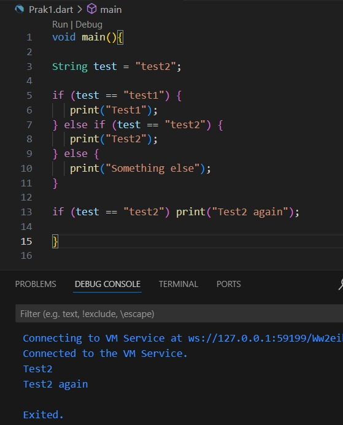

# PRAKTIKUM 1

LANGKAH 1 

Ketik atau salin kode program berikut ke dalam fungsi main().

LANGKAH 2

Silakan coba eksekusi (Run) kode pada langkah 1 tersebut. Apa yang terjadi? Jelaskan!
Jawab : 
Test2 dicetak oleh blok else if karena kondisi test = "test2" terpenuhi , serta Test2 again ini dicetak oleh pernyataan if kedua yang juga memeriksa kondisi test == "test2" karena memenuhi

LANGKAH 3

Tambahkan kode program berikut, lalu coba eksekusi (Run) kode Anda.

Hasil run adalah error , lalu berikut adalah perbaikan kodenya sehingga dapat di run.

Penjelasannya :
String test = "true" diubah menjadi bool 
testBool = true; karena kita membutuhkan nilai Boolean untuk kondisi if , kesimpulannya adalah if membutuhkan nilai Boolean (true atau false) karena string tidak bisa dipakai langsung dalam kondisi if , jadi dibutuhkan variable Boolean seperti testBool

# PRAKTIKUM 2

LANGKAH 1

Ketik atau salin kode program berikut ke dalam fungsi main().

LANGKAH 2

Silakan coba eksekusi (Run) kode pada langkah 1 tersebut. Apa yang terjadi? Jelaskan! Lalu perbaiki jika terjadi error.

Penjelasannya :
Deklarasi Variabel : int counter = 0; mendeklarasikan counter sebagai integer dan menginisialisasikannya ke 0 sebelum digunakan dalam loop

LANGKAH 3

Tambahkan kode program berikut, lalu coba eksekusi (Run) kode Anda.
Apa yang terjadi ? Jika terjadi error, silakan perbaiki namun tetap menggunakan do-while.
Jawab : Hasil run dari praktikum 2 langkah 3 adalah error , pembenarannya adalah sebagai berikut :

Penjelasannya : 
Deklarasi Variabel : int counter = 0; mendeklarasikan counter sebagai integer dan menginisialisasikannya ke 0 sebelum digunakan dalam loop

# PRAKTIKUM 3

LANGKAH 1

Ketik atau salin kode program berikut ke dalam fungsi main().

Hasilnya error , pembenaran kode berada di langkah 2 dibawah ini

LANGKAH 2

Silakan coba eksekusi (Run) kode pada langkah 1 tersebut. Apa yang terjadi? Jelaskan! Lalu perbaiki jika terjadi error.

Penjelasannya :
- Mendeklarasikan Variabel : int index = 10; mendeklarasikan index sebagai integer dan menginisialisasikannya ke 10 sebelum digunakan dalam loop
- Kondisi Loop : Mengggunakan index < 27; sebagai kondisi untuk melanjutkan loop
- Increment : Mengubah index menjadi index++ agar index meningkat satu setiap iterasi

LANGKAH 3

Tambahkan kode program berikut di dalam for-loop, lalu coba eksekusi (Run) kode Anda.

Apa yang terjadi ? Jika terjadi error, silakan perbaiki namun tetap menggunakan for dan break-continue.
Jawab : pembenaran kode di atas yang error adalah sebagai berikut :

Penjelasannya :
- if (index == 21) break; Jika index sama dengan 21 , loop akan dihentikan
- else if (index > 1 && index < 7) continue; Jika index lebih besar dari 1 dan kurang dari 7 , loop akan melewati iterasi tersebut
- print(index);: Mencetak nilai index setelah kondisi diperiksa

TUGAS PRAKTIKUM PERTEMUAN 3

Buatlah sebuah program yang dapat menampilkan bilangan prima dari angka 0 sampai 201 menggunakan Dart. Ketika bilangan prima ditemukan, maka tampilkan nama lengkap dan NIM Anda.

